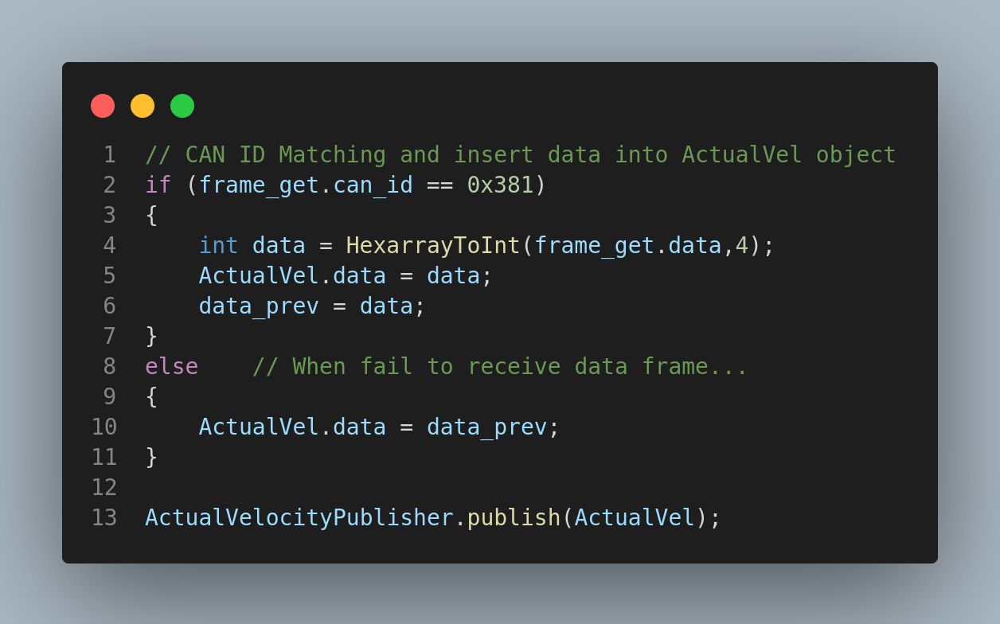

# ROS_EPOS2_CAN_TEST
Profile Velocity Mode

Msg info: std_msgs/Int32

Topic to subscribe: /TargetVel

Topic to publish: /ActualVel

CAN Data histogram result

Subscribe topic info : TargetVel 100 Hz

1. Target Velocity Discrete Time histogram result

2. Actual Velocity Discrete Time histogram result

3. t - RPM graph

4. Code Modified

Firstly, check CAN ID and when the ID matches that of data we want to get, publish the data.

CAN is adept at recovering error by transmitting request again when error takes place.

In that sense, it is essential to check CAN id to get data.

