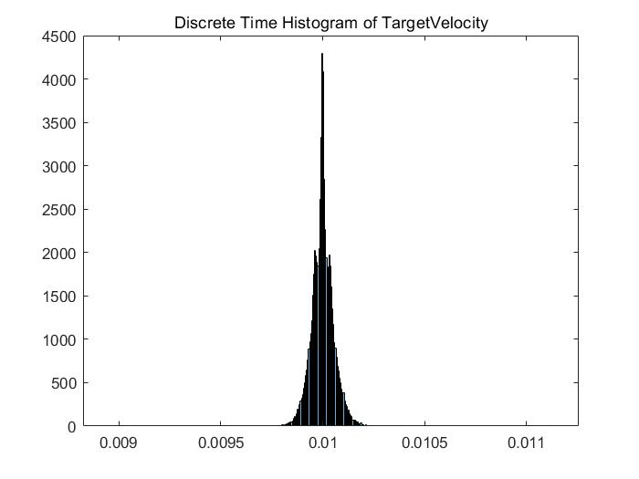
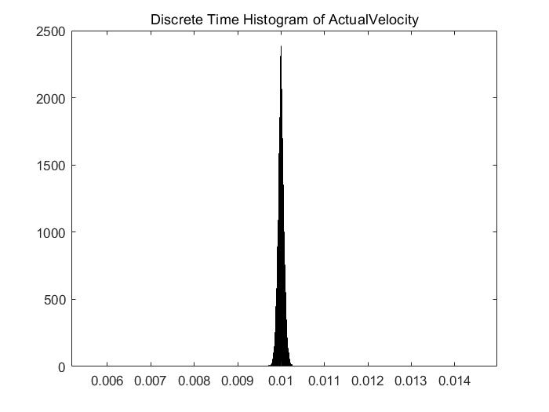
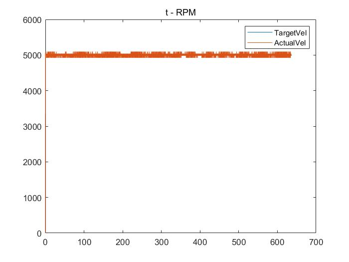

# ROS_EPOS2_CAN_TEST
Profile Velocity Mode

Msg info: std_msgs/Int32

Topic to subscribe: /TargetVel

Topic to publish: /ActualVel

CAN Data histogram result

Subscribe topic info : TargetVel 100 Hz

1. Target Velocity Discrete Time histogram result

2. Actual Velocity Discrete Time histogram result

3. t - RPM graph

4. Part of CAN log

(1631436161.965612) slcan0 381#R6

(1631436161.968415) slcan0 381#00000000

(1631436161.975502) slcan0 401#0F0088130000

(1631436161.975562) slcan0 381#R6

(1631436161.978415) slcan0 381#60010000

(1631436161.985487) slcan0 401#0F0088130000

(1631436161.985546) slcan0 381#R6

(1631436161.988390) slcan0 381#6F030000

(1631436161.995488) slcan0 401#0F0088130000

(1631436161.995546) slcan0 381#R6

(1631436161.998390) slcan0 381#7E050000

(1631436162.005467) slcan0 401#0F0088130000

The below order must be followed.

Request -> Get Actual Velocity data from EPOS2 driver -> Send Target Velocity data to EPOS2 driver

If the protocol does not obey the order, the system could be problematic.

The reason why the publisher publishes its message in the callback function is to obey the order.
